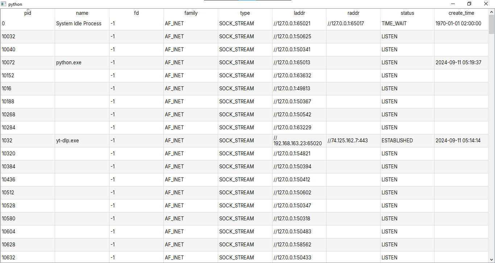

<p align="center">
    
</p>


<p align="justify">
 <strong>Kudan</strong> is a desktop operating system monitoring application that provides real-time insights into system performance, resource management and key metrics, offering a reliable and efficient way to monitor your computer.
 <p/>
 <p align="justify">
    This application makes use of the <a href="https://github.com/giampaolo/psutil">psutil</a> library, a cross-platform library for retrieving information on running processes and system utilization (CPU, memory, disks, network, sensors) and system uptime.
</p>

---

```sh
python -m venv "./.venv"
source "./venv/Scripts/activate"
```

```sh
python3 -m venv "./.venv"
source "./venv/bin/activate"
```

```sh
pip install -r requirements.txt
```

```sh
pyinstaller "./main.py" --noconfirm --clean --onefile --name="Kudan" --icon="./favicon.ico" --add-data="./favicon.ico:./" --add-data="./inter:./" --windowed
```


