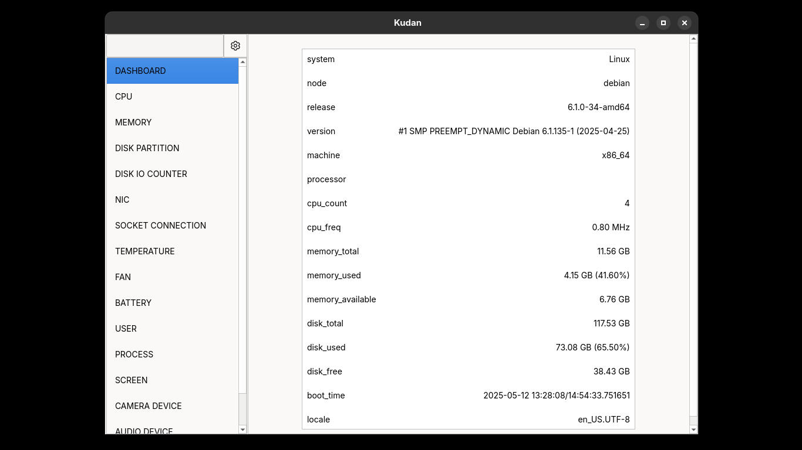

<p align="center">
    
</p>


```sh
python -m venv "./.venv"
source "./venv/Scripts/activate"
pip install -r requirements.txt
```

```sh
pyinstaller "./src/main.py" --noconfirm --clean --onefile --name="Kudan" --icon="./icon.ico" --add-data="./icon.ico:./" --add-data="./Inter-Regular.ttf:./" --add-data="./Inter-Medium.ttf:./" --add-data="./Inter-Bold.ttf:./" --add-data="./JetBrainsMono-Regular.ttf:./" --windowed
```


